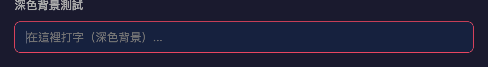
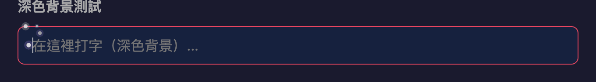
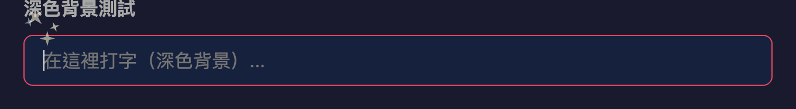
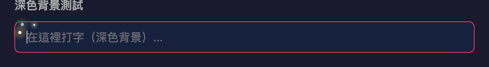
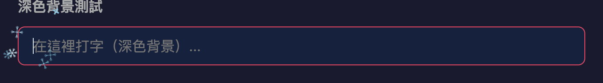
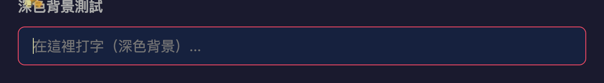
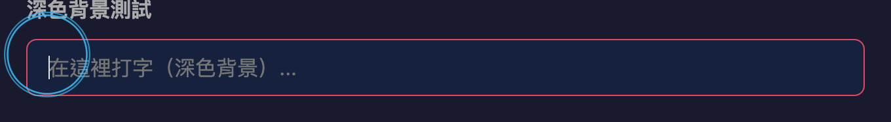

# Typing Particles

A Chrome Extension that displays real-time particle effect animations when users type in any text input field on any webpage. It offers 12 visual styles to switch between, supports multiple languages (English / Traditional Chinese / Simplified Chinese / Japanese / Korean / Spanish), and all settings are configured through a Popup panel with instant effect.

---

## Table of Contents

1. [Feature Overview](#feature-overview)
2. [Installation & Testing](#installation--testing)
3. [File Structure](#file-structure)
4. [Effect Showcase](#effect-showcase)
5. [Effect Interface Specification & Extension Guide](#effect-interface-specification--extension-guide)
6. [Internationalization (i18n)](#internationalization-i18n)
7. [Performance Design](#performance-design)
8. [Known Limitations](#known-limitations)

---

## Feature Overview

| Feature | Description |
|---|---|
| Twelve particle effects | Burst / Text Echo / Vortex / Sparkle / Firefly / Confetti / Bubble / Frost / Flame / Ripple / Electric / Diffuse |
| Real-time switching | Select via Popup panel, no page reload required |
| Intensity control | Slider 0.1 – 1.0 to control particle count multiplier |
| Global toggle | One-click enable or disable all effects |
| Multi-language support | Supports English / Traditional Chinese / Simplified Chinese / Japanese / Korean / Spanish, auto-detects browser locale |
| Cross-device sync | Settings stored in `chrome.storage.sync` |
| Supports all input fields | `<input>` / `<textarea>` / `contenteditable` |
| Privacy protection | Automatically skips `<input type="password">` |
| IME support | Suppressed during composition, triggered on input confirmation |
| iframe support | `all_frames: true`, input fields within child frames also work |
| Adaptive background colors | Automatically detects input field background brightness and switches between dark/light color palettes for optimal visibility on any background |
| Zero interference | Canvas layer uses `pointer-events: none`, does not affect any page interaction |

---

## Installation & Testing

### Method 1: Load in Developer Mode (Recommended for Testing)

1. Open Chrome, enter `chrome://extensions/` in the address bar
2. Enable "**Developer mode**" in the top-right corner
3. Click "**Load unpacked**" in the top-left corner
4. Select the `typing-particles/` **root directory** (the folder containing `manifest.json`)
5. The extension appearing as "Typing Particles" in the extensions list confirms successful loading
6. Open any webpage (e.g., Google Search, GitHub, Gmail), type in an input field to see the particle effects
7. Click the extension icon in the top-right of the browser to open the Popup panel for switching effects and adjusting intensity

### Method 2: Use the Prototype Page (For Quick Visual Verification Only)

1. Open `typing-particles/prototype/index.html` in a browser
2. The page includes four built-in input types: text input, textarea, contenteditable, and password
3. The top control panel allows switching effects, adjusting intensity, and viewing active particle count
4. This prototype runs locally and does not depend on the Chrome Extension API

### Testing Checklist

- [ ] Type in `<input type="text">`, particles appear near the caret
- [ ] Type in `<textarea>` with multiline text, particles follow the caret across line breaks
- [ ] Type in a `contenteditable` area, particles display correctly
- [ ] Type in `<input type="password">`, particles do **not** appear (privacy protection)
- [ ] Switch between the twelve effects via Popup, effects change instantly
- [ ] Adjust the intensity slider, particle count changes accordingly
- [ ] Turn off the effect toggle, particles stop immediately and disappear
- [ ] No stuttering during rapid typing (confirm no dropped frames in the Performance panel)
- [ ] On pages with iframes (e.g., CodePen), input fields within iframes also show effects
- [ ] Using IME input methods such as Zhuyin/Pinyin: no particles during composition, triggered after pressing Enter to confirm
- [ ] On light background input fields (e.g., Google Search), effects use darker color palettes and remain clearly visible
- [ ] On dark background input fields, effects use lighter/brighter color palettes

---

## File Structure

```
typing-particles/
├── manifest.json                # Manifest V3 configuration
├── _locales/                    # Multi-language translation files
│   ├── en/messages.json         # English (default)
│   ├── zh_TW/messages.json      # Traditional Chinese
│   ├── zh_CN/messages.json      # Simplified Chinese
│   ├── ja/messages.json         # Japanese
│   ├── ko/messages.json         # Korean
│   └── es/messages.json         # Spanish
├── icons/
│   ├── icon16.png
│   ├── icon32.png
│   ├── icon48.png
│   └── icon128.png
├── popup/
│   ├── popup.html               # Settings panel UI (translation points marked with data-i18n attributes)
│   ├── popup.css                # Settings panel styles (dark theme, 4×3 grid)
│   └── popup.js                 # Settings read/write logic + i18n initialization
├── content/
│   ├── content.js               # Entry point: event listeners, input detection, context assembly
│   ├── caret-detector.js        # Caret pixel position detection (mirror div + Selection API)
│   ├── canvas-manager.js        # Canvas overlay lifecycle (wrapped in Shadow DOM)
│   ├── particle-engine.js       # Particle object pool + requestAnimationFrame animation loop
│   ├── settings-bridge.js       # chrome.storage.onChanged listener bridge
│   └── effects/
│       ├── burst.js             # 💥 Burst
│       ├── echo.js              # 🔤 Text Echo
│       ├── vortex.js            # 💫 Vortex
│       ├── sparkle.js           # ⭐ Sparkle
│       ├── firefly.js           # ✨ Firefly
│       ├── confetti.js          # 🎊 Confetti
│       ├── bubble.js            # 🫧 Bubble
│       ├── frost.js             # ❄️ Frost
│       ├── flame.js             # 🔥 Flame
│       ├── ripple.js            # 🌊 Ripple
│       ├── electric.js          # ⚡ Electric
│       └── diffuse.js           # 🌀 Diffuse
├── shared/
│   └── constants.js             # Default values, effect registry
└── prototype/                   # Standalone prototype (not shipped with the Extension)
    ├── index.html
    ├── prototype.js
    └── prototype.css
```

---

## Effect Showcase

| | | |
|:---:|:---:|:---:|
| **💥 Burst** | **🔤 Text Echo** | **💫 Vortex** |
|  |  |  |
| **⭐ Sparkle** | **✨ Firefly** | **🎊 Confetti** |
|  |  |  |
| **🫧 Bubble** | **❄️ Frost** | **🔥 Flame** |
|  |  |  |
| **🌊 Ripple** | **⚡ Electric** | **🌀 Diffuse** |
|  |  |  |

> For architecture design and algorithm details of all twelve effects, see [docs/implementation.md](docs/implementation.md)

---

## Effect Interface Specification & Extension Guide

Each effect is a standalone JavaScript object that must implement the following interface:

```javascript
const MyEffect = {
  name: 'my-effect',           // Unique identifier (corresponds to EFFECT_REGISTRY)
  label: 'My Effect',          // Display name (used in Popup UI)
  icon: '🎨',                  // Popup card icon

  /**
   * Spawn particles at caret position (x, y)
   * @param {number} x         - viewport X coordinate
   * @param {number} y         - viewport Y coordinate
   * @param {number} intensity - intensity multiplier 0.1-1.0
   * @param {Function} acquire - acquire an idle particle from the object pool, returns particle object or null
   * @param {Object|null} context - { char, fontFamily, fontSize, fontWeight }
   */
  spawn(x, y, intensity, acquire, context) { ... },

  /**
   * Update a single particle's state each frame
   * @param {Object} p - particle object
   */
  update(p) { ... },

  /**
   * Render a single particle each frame
   * @param {CanvasRenderingContext2D} ctx
   * @param {Object} p - particle object
   */
  render(ctx, p) { ... }
};
```

### Steps to Add a New Effect

1. Add a new JS file in `content/effects/` (e.g., `my-effect.js`), implementing the interface above
2. Add the name to the `EFFECT_REGISTRY` array in `shared/constants.js`
3. Add the file path to the `content_scripts.js` array in `manifest.json`
4. Add the mapping to the `EFFECTS` object in `content/content.js`
5. Add a button to the `effect-list` in `popup/popup.html` (with `data-i18n` attribute)
6. Add the translation key to all `_locales/*/messages.json` files
7. Add a button and `<script>` tag in `prototype/index.html`
8. Add the mapping to the `EFFECTS` object in `prototype/prototype.js`

---

## Internationalization (i18n)

Uses the Chrome Extension built-in `chrome.i18n` API, automatically displaying the corresponding language based on the browser locale.

### Supported Languages

| Locale Code | Language | Example (Firefly) |
|---|---|---|
| `en` | English (default) | Firefly |
| `zh_TW` | Traditional Chinese | 螢光漫舞 |
| `zh_CN` | Simplified Chinese | 萤光漫舞 |
| `ja` | Japanese | 蛍の光 |
| `ko` | Korean | 반딧불이 |
| `es` | Spanish | Luciérnaga |

### How It Works

- `name` and `description` in `manifest.json` use `__MSG_key__` placeholders, which Chrome automatically replaces with the translation for the corresponding locale
- UI text elements in `popup.html` are marked with `data-i18n="key"` attributes, defaulting to English
- On startup, `popup.js` calls `chrome.i18n.getMessage()` to replace the text content of all `data-i18n` elements one by one
- Translation files are located at `_locales/{locale_code}/messages.json`

### Steps to Add a New Language

1. Create a locale folder under `_locales/` (e.g., `_locales/fr/`)
2. Create a `messages.json` containing translations for all keys
3. No modifications to any JS or HTML code are needed

---

## Performance Design

| Design | Performance Impact |
|---|---|
| Object pool (300 particles pre-allocated) | Zero memory allocation, zero GC pressure |
| requestAnimationFrame auto start/stop | 0% CPU usage when not typing |
| Canvas `display:none` | Zero compositing cost when not typing |
| Event throttle 16ms | At most one input processed per frame |
| Offscreen canvas reuse | Diffuse effect avoids repeated creation |
| `willReadFrequently` hint | getImageData uses CPU path, faster |
| Large font pixel step ×2 | Edge detection scan volume reduced by 75% |
| Closed Shadow DOM | Page CSS cannot trigger reflow |
| Background detection via DOM walk-up | One `getComputedStyle` call per input, negligible cost |

Typical rapid typing scenario (10 keystrokes/sec): ~100 particles rendered per frame, taking approximately 0.5-1ms, well within the 16.6ms frame budget.

---

## Known Limitations

| Limitation | Reason |
|---|---|
| Google Docs / Sheets / Slides | Uses custom Canvas rendering, does not trigger standard `input` events |
| Input fields inside Closed Shadow DOM | Browser security policy prohibits external access to closed shadow roots |
| Diffuse / Text Echo effects do not trigger on delete key | `e.data` is `null`, no character available to render |
| Some highly customized rich text editors (e.g., Monaco Editor) | May use non-standard input mechanisms |
